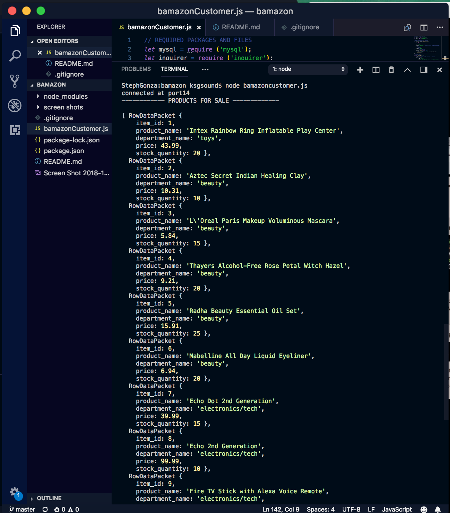
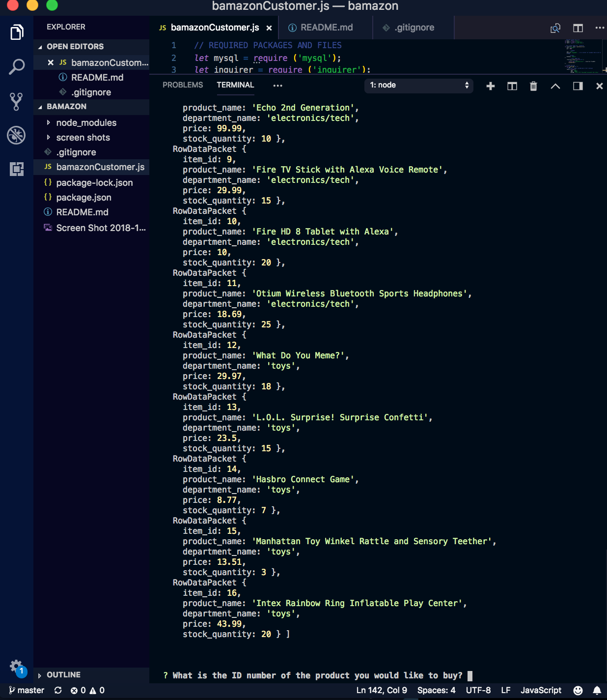
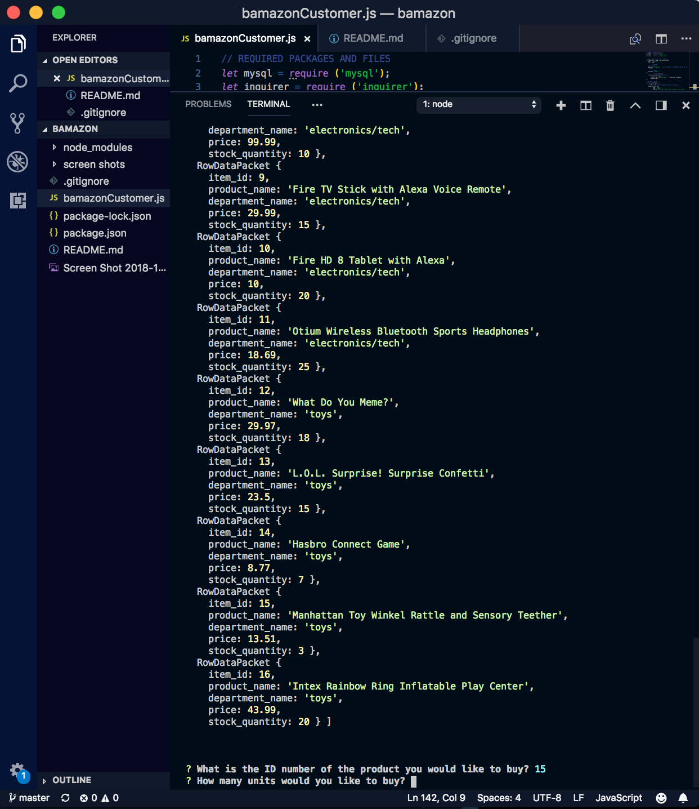
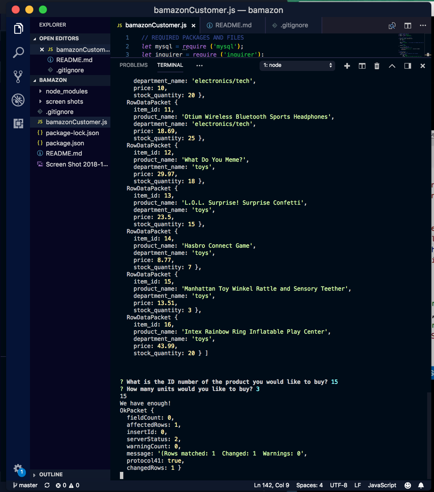

# bamazon

## **Welcome to my bAmazon application!** 
### In this application an Amazon-like storefront was created using MySQL. The application takes orders from customers and will update stock from the inventory. 

## **Technologies used were**:
- NodeJS,
- MySQL,
- JavaScript 
- NPM inquirer,
- MAC terminal 
- init -y,

## **Customer**:
In the terminal a customer will be able to view products, the department the product is located, and the price. The customer can select given product and chose quantity desired. If the customer desires more than the quantity available the application will prompt the customer to choose another quantity amount. 
- **node bamazonCustomer.js**

## **Screen Shots**:
### Screenshot of terminal after running node customerbamazon.js

### Screenshot of terminal when first question (What item would the customer like) is prompted. 

### Screenshot of terminal when second question (Desired Quantity) is prompted. 

### Screenshot of application's final terminal output. 
